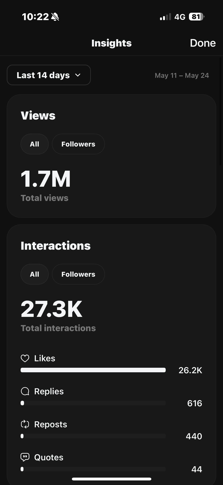

# 🔥 Threads Viral Content AI Agent

> **Status: Currently Paused** - Development temporarily halted due to other side projects.

An AI-powered system that analyzes viral content patterns on Meta's Threads platform and generates engaging posts designed to maximize reach and engagement.

## 🎯 Project Vision

This project emerged from my experience as a Meta app and Threads influencer. 

The core idea is to create an intelligent system that:

1. **Fetches viral content** from Threads (posts with high likes, comments, shares, etc.)
2. **Analyzes patterns** using LLM and NLP methods to understand what makes content go viral
3. **Generates optimized content** that mimics successful viral post characteristics
4. **Automates posting** to create a fully autonomous AI agent for viral content creation

The ultimate goal is to develop an AI agent that has deep insights into viral content mechanics and can consistently create engaging posts that resonate with audiences.

## 🚀 Current Features

- **Threads API Integration**: Fetch posts from your Threads account using Instagram Graph API
- **High-Traffic Filtering**: Automatically identify posts that exceed specified engagement thresholds
- **Configurable Parameters**: Customize minimum likes, views, and other filtering criteria
- **Data Export**: Save filtered viral posts to JSON for analysis
- **Environment Management**: Secure API token handling with `.env` files

## 📁 Project Structure

```
threads/
├── main.py              # Main orchestration script
├── fetch_threads.py     # Threads API interaction and filtering logic
├── config.py           # Configuration management and CLI arguments
├── requirements.txt    # Python dependencies
├── .env               # Environment variables (API tokens)
└── README.md          # This file
```

## 🛠️ Setup & Installation

### Prerequisites

- Python 3.7+
- Threads/Instagram API access token
- Meta Developer Account

### Installation Steps

1. **Clone the repository**
   ```bash
   git clone <your-repo-url>
   cd threads
   ```

2. **Install dependencies**
   ```bash
   pip install -r requirements.txt
   ```

3. **Configure environment variables**
   Create a `.env` file in the project root:
   ```env
   THREADS_ACCESS_TOKEN=your_threads_api_token_here
   ```

4. **Get your Threads API token**
   - Visit [Meta for Developers](https://developers.facebook.com/)
   - Create a new app and configure Instagram Basic Display
   - Generate an access token with appropriate permissions
   - Add the token to your `.env` file

## 📖 Usage

### Basic Usage

Run the script with default settings:
```bash
python main.py
```

### Advanced Configuration

Customize filtering parameters:
```bash
python main.py --min_likes 500 --min_views 1000 --output data/custom_posts.json
```

### Command Line Options

- `--min_likes`: Minimum likes threshold for viral posts (default: 100)
- `--min_views`: Minimum views threshold for viral posts (default: 0)
- `--output`: Output file path for filtered posts (default: `data/high_traffic_posts.json`)

### Example Output

The script generates a JSON file containing viral posts:
```json
[
  {
    "id": "post_id_123",
    "caption": "Your viral post content here...",
    "like_count": 1250,
    "comments_count": 89
  }
]
```

## 🗺️ Roadmap

### Phase 1: Data Collection ✅
- [x] Threads API integration
- [x] High-traffic post filtering
- [x] Data export functionality

### Phase 2: Content Analysis (Planned)
- [ ] NLP analysis of viral post patterns
- [ ] Sentiment analysis and topic modeling
- [ ] Engagement prediction models
- [ ] Content categorization system

### Phase 3: AI Content Generation (Planned)
- [ ] LLM integration for content generation
- [ ] Template-based post creation
- [ ] Style and tone matching
- [ ] A/B testing framework

### Phase 4: Automation (Planned)
- [ ] Automated posting capabilities
- [ ] Scheduling and optimization
- [ ] Performance monitoring
- [ ] Feedback loop integration

## 🔧 Development

### Project Architecture

The current implementation follows a modular approach:
- **Data Layer**: `fetch_threads.py` handles API interactions
- **Configuration**: `config.py` manages settings and environment variables  
- **Orchestration**: `main.py` coordinates the entire workflow

### Contributing

This project is currently in early development. Contributions are welcome once development resumes.

### API Limitations

- Threads API access may have rate limits
- Post visibility depends on your account's permissions
- Some metrics (like views) may not be available depending on API version

## 📄 License

[Add your preferred license here]

## 🤝 Contact

[Add your contact information]

---

*This project represents an exploration into AI-driven social media content creation. Use responsibly and in accordance with platform guidelines.*